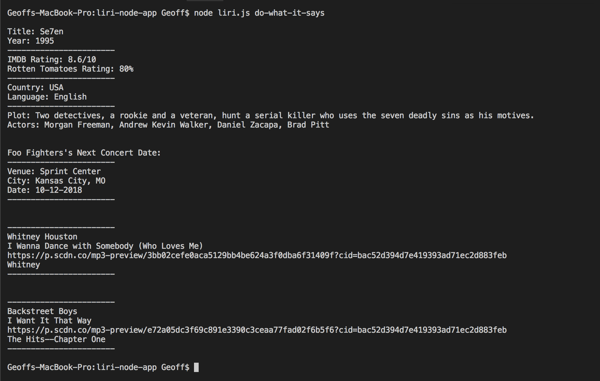
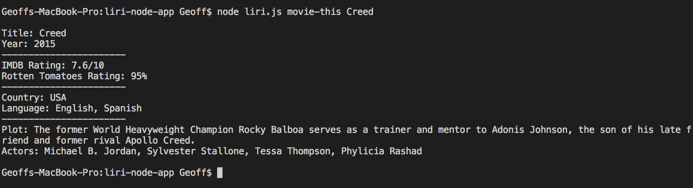

# LIRI Node Application
## Using Node and few commands, you can find out a bunch of useful information!

* Find Information about a certain song
* See if an artist is on tour
* Get information about a particular movie
* __Bonus:__
    * Keep a running log of your past searches
    * Keep a list of frequently asked commands to run all at once

1. To get started, type: 
    ```javascript
    node liri.js
    ```

1. Then enter the query command you'd like to run. 
    Currently available queries are:
    * `spotify-this-song` - searches Spotify for information on a song
    * `movie-this` - search IMDb (using OMDb) to retrieve information about a particular movie
    * `concert-this` - use the Bands In Town API to see when a certain Band/Performer's next concert is

1. Finally, enter the information your looking for:
    * `spotify-this-song` - searches for only song titles
    * `movie-this` - searches only movie titles
    * `concert-this` - searches only artists/bands


Format: 

If you want to see a log of your searches, check the `log.txt` file.

### Running multiple commands at once
If you want to run multiple commands at once, run the `do-what-it-says` command. 

This command will run the commands in the `random.txt` file:

To update this file, format the commands like this: _"command,query"_, with each command going on it's own line.


Format: 

